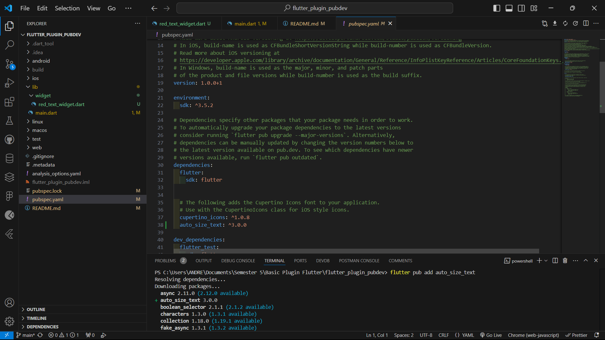
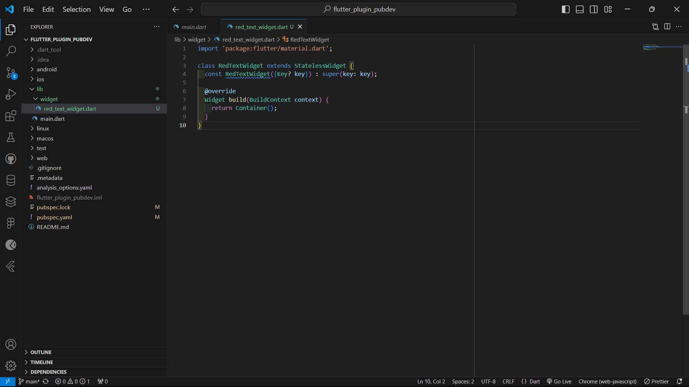
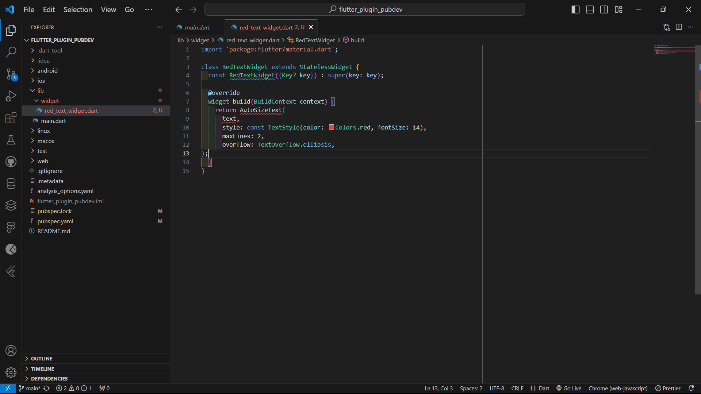
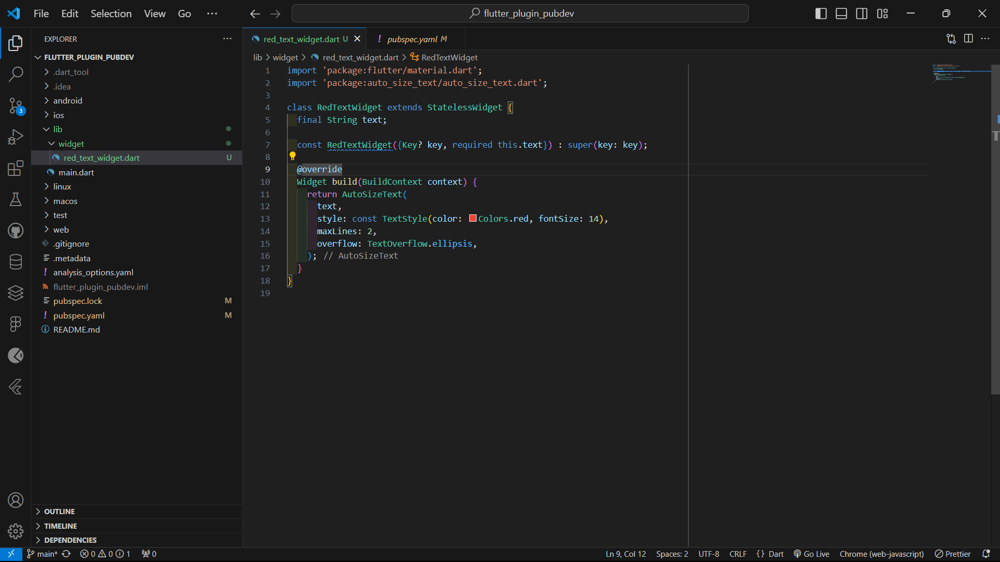

# flutter_plugin_pubdev

**NAMA : ANDREAGAZY IZA AMERIANTO**  
**NIM   : 2241720145**  
**KELAS : TI-3A / 03**  

## Praktikum

## No 1 - Selesaikan Praktikum tersebut, lalu dokumentasikan dan push ke repository Anda berupa screenshot hasil pekerjaan beserta penjelasannya di file `README.md`!
### Langkah 1: Buat Project Baru
Buatlah sebuah project flutter baru dengan nama `flutter_plugin_pubdev`. Lalu jadikan repository di GitHub Anda dengan nama `flutter_plugin_pubdev`.

### Langkah 2: Menambahkan Plugin
Tambahkan plugin auto_size_text menggunakan perintah berikut di terminal

Jika berhasil, maka akan tampil nama plugin beserta versinya di file pubspec.yaml pada bagian dependencies.

### Langkah 3: Buat file red_text_widget.dart
Buat file baru bernama red_text_widget.dart di dalam folder lib lalu isi kode seperti berikut.

### Langkah 4: Tambah Widget AutoSizeText
Masih di file red_text_widget.dart, untuk menggunakan plugin auto_size_text, ubahlah kode return Container() menjadi seperti berikut.

Setelah Anda menambahkan kode di atas, Anda akan mendapatkan info error. Mengapa demikian? Jelaskan dalam laporan praktikum Anda!  

**Jawab**  
Terjadi error karena variabel text belum didefinisikan dan belum melakukan import untuk package AutoSizeText

### Langkah 5: Buat Variabel text dan parameter di constructor
Tambahkan variabel text dan parameter di constructor seperti berikut.

### Langkah 6: Tambahkan widget di main.dart
Buka file main.dart lalu tambahkan di dalam children: pada class _MyHomePageState

## No 2 - Jelaskan maksud dari langkah 2 pada praktikum tersebut!
Perintah flutter pub add auto_size_text di terminal digunakan untuk menambahkan plugin auto_size_text ke dalam proyek Flutter secara otomatis dan dapat dilihat di `pubspec.yaml` pada bagian `dependencies`.

## No 3 - Jelaskan maksud dari langkah 5 pada praktikum tersebut!
Membuat variabel baru beru bernama `text` dan `RedTextWidget({Key? key, required this.text})` adalah konstruktor dari kelas RedTextWidget. Konstruktor ini digunakan untuk membuat objek RedTextWidget.

### No 4 - Pada langkah 6 terdapat dua widget yang ditambahkan, jelaskan fungsi dan perbedaannya!
- Container dengan RedTextWidget:
Fungsi: Menampilkan teks dalam warna merah dengan lebar 50 piksel. RedTextWidget adalah widget kustom yang menerima teks dan menerapkan gaya khusus.
- Container dengan Text:
Fungsi: Menampilkan teks dengan lebar 100 piksel. Text adalah widget bawaan yang menampilkan teks dalam gaya default.

## No 5 - Jelaskan maksud dari tiap parameter yang ada di dalam plugin auto_size_text berdasarkan tautan pada dokumentasi ini 
### Parameter Penjelasan AutoSizeText                                                                              

- `key`                  Mengontrol bagaimana satu widget menggantikan widget lain di dalam tree.                      
- `textKey`              Menetapkan key untuk widget Text yang dihasilkan.                                              
- `style`                Gaya teks yang akan digunakan (misalnya warna, font, ukuran, dll.).                            
- `minFontSize`          Ukuran font minimum untuk teks saat menyesuaikan ukuran otomatis.                              
- `maxFontSize`          Ukuran font maksimum untuk teks saat menyesuaikan ukuran otomatis.                             
- `stepGranularity`      Ukuran langkah perubahan font ketika disesuaikan sesuai batasan.                               
- `presetFontSizes`      Daftar ukuran font yang sudah ditentukan sebelumnya (dalam urutan menurun).                    
- `group`                Menyinkronkan ukuran beberapa teks AutoSizeText secara bersamaan.                              
- `textAlign`            Menentukan bagaimana teks disejajarkan secara horizontal.                                      
- `textDirection`        Arah teks (misalnya kiri ke kanan atau kanan ke kiri).                                         
- `locale`               Digunakan untuk memilih font yang sesuai berdasarkan locale.                                   
- `softWrap`             Apakah teks harus memutus di soft line breaks.                                                 
- `wrapWords`            Apakah kata yang tidak muat di satu baris harus dibungkus. Default adalah `true`.              
- `overflow`             Bagaimana menangani visual overflow teks.                                                      
- `overflowReplacement`  Widget yang ditampilkan ketika teks meluap dan tidak sesuai dengan batasnya.                   
- `textScaleFactor`      Skala ukuran teks yang mempengaruhi ukuran font, termasuk `minFontSize` dan `maxFontSize`.     
- `maxLines`             Batas jumlah baris maksimum yang dapat digunakan oleh teks.                                    
- `semanticsLabel`       Label semantik alternatif untuk teks ini, digunakan untuk aksesibilitas.                       
